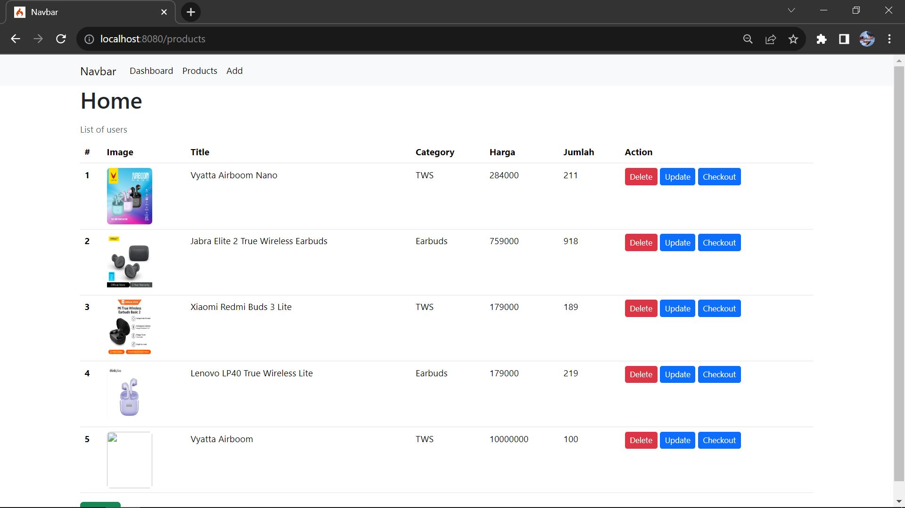
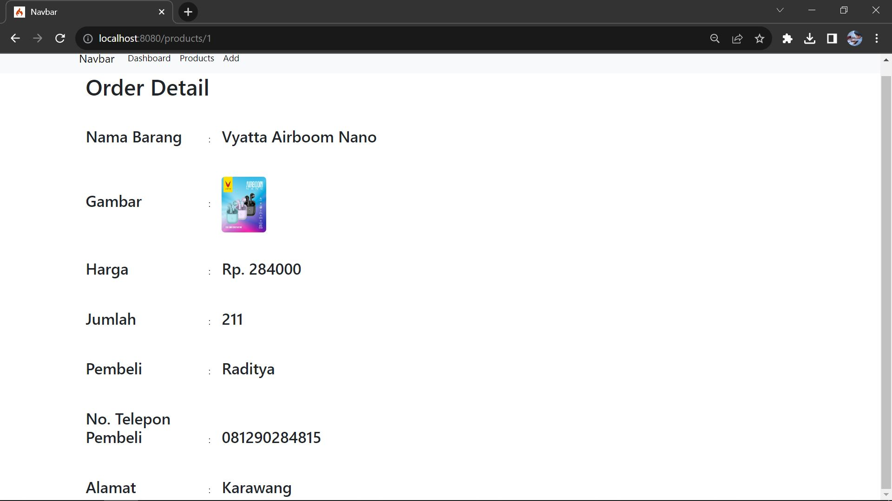

Aplikasi Simple Online Shop

## Installasi
1. Atur database di app\Config\Database.php
  public array $default = [
    'DSN'          => '',
    'hostname'     => 'localhost',
    'username'     => 'root',
    'password'     => '',
    'database'     => 'ecom_2',
  ];
  
2. php spark db:seed ProductsSeeder

## Fitur
1. Halaman Login
    ```
    http://localhost:8080/
    ```


2. Create Account
    ```
    http://localhost:8080/
    ```


2. Halaman Dashboard
    ```
    http://localhost:8080/dashboard
    ```

	
3. Halaman Products
    ```
    http://localhost:8080/products
    ```


4. Seeder Products
php spark db:seed ProductsSeeder

5. Menghapus Product


6. Mengupdate Product


7. Checkout Product


8. Pop up Modal


9. Form Add Product
